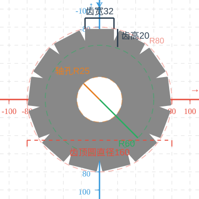
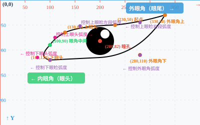

# AI-generated SVG Usecase Gallery

**English** | [中文🇨🇳](README-zh.md)

## ☯ Tai-Ji Animation

- Built with HTML, CSS, JS, and SVG
- 0 software installation required

You can interact with [Tai-Ji Animation](tai-ji-animation.html) in any web browser

---

## ⚙️ Gear Design

- Pure SVG built
- 0 software installation required

Open the following SVG files in any web browser for viewing, or open the files in any editor to modify the code:
- [Gear design without stroke, with coordinate axis, and with dimension labels](齿轮-无描边-有坐标轴尺寸标注.svg)
- [Gear design without stroke](齿轮-无描边.svg)
- [Gear design with stroke](齿轮-有描边.svg)

---

## 🎨 Dan-Feng-Eye Drawing

- Pure SVG built
- 0 software installation required

Open the following SVG files in any web browser for viewing, or open the files in any editor to modify the code:
- [Drawing of Dan-Feng-Eye with coordinate axis and coordinate labels](丹凤眼-有坐标轴与标注.svg)
- [Drawing of Dan-Feng-Eye with coordinate axis, and without coordinate labels](丹凤眼-有坐标轴-无标注.svg)

---

# License
MIT © 2026 y-in-gb
